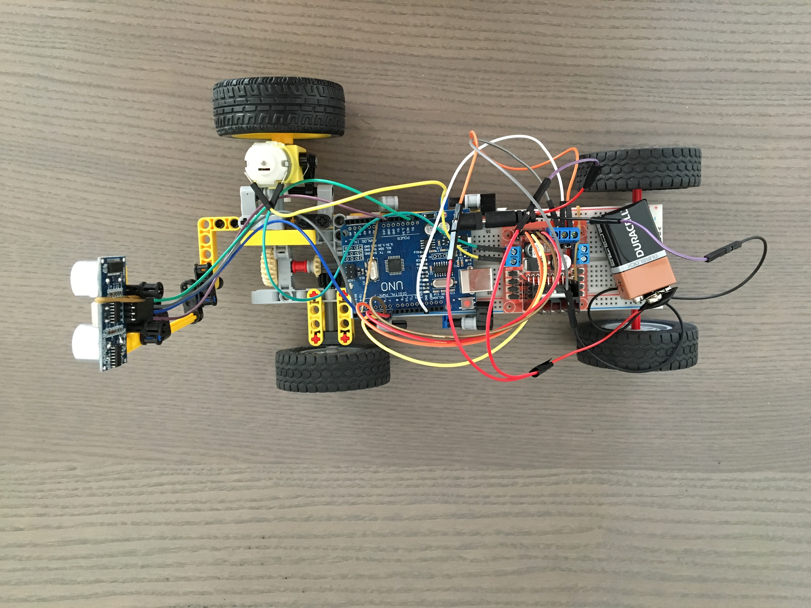

# Self driving car 
> experiments with Arduino and Lego technic parts

## Version 1
It's the first version of my autonomous car experiments.
I'm new to many of the topics here, so it's just the starting point.

* use Arduino as a controller
* read distance data from ultrasonic sensor
* drive rc motor using L298N driver
* obstacle avoidance with back and forth movement
* build chase and distance sensor holder from Lego technic parts

*See it in action* 
https://www.instagram.com/p/BR0HgL5Bhza/?taken-by=yortuc

### Version 2 Goals
- build a streeing mechanism with Lego technic parts 
- use servo motor for steering 
- rotate distance sensor with servo motor 
- avoid obstacles with a steering strategy 